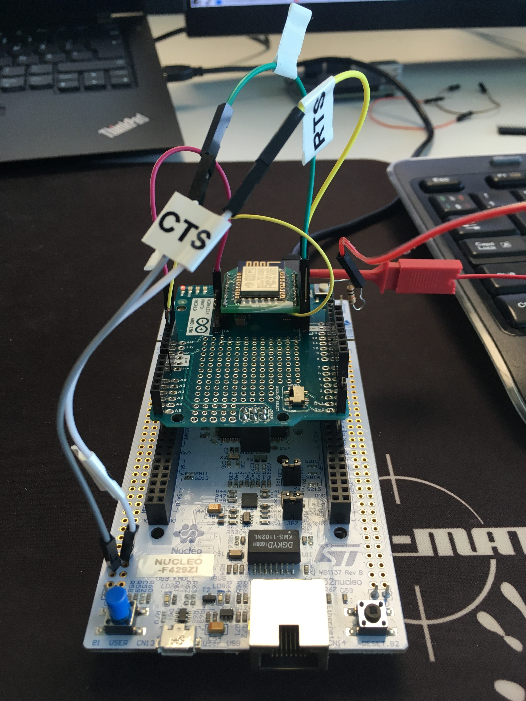
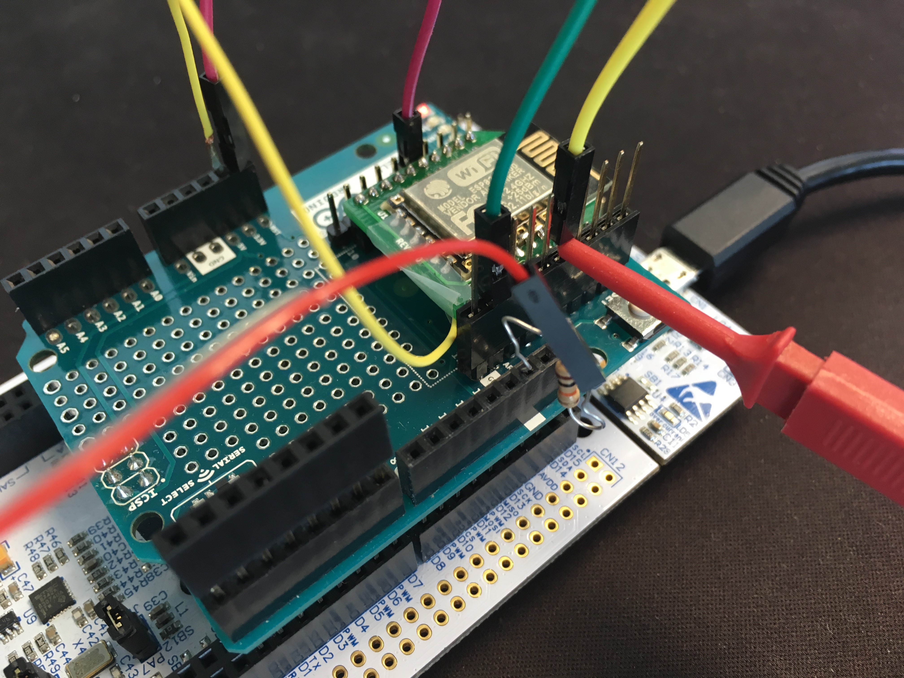

# ESP8266 WiFi driver for Mbed OS

The Mbed OS driver for the ESP8266 WiFi module.

## Firmware version

ESP8266 modules come in different shapes and formats, but the most important factor is the firmware version in it. To
make sure that the firmware in your module is compatible with Mbed OS, follow the
[Update guide](https://developer.mbed.org/teams/ESP8266/wiki/Firmware-Update).

It is advisable to update the [AT firmware](https://www.espressif.com/en/support/download/at?keys=) at least to version
1.7.0.0

## Restrictions

- The ESP8266 WiFi module does not allow the TCP client to bind on a specific port.
- Setting up a UDP server is not possible.
- The serial port does not have hardware flow control enabled by default. The AT command set does not either have a way
to limit the download rate. Therefore, downloading anything larger than the serial port input buffer is unreliable. An
application should be able to read fast enough to stay ahead of the network. This affects mostly the TCP protocol where
data would be lost with no notification. On UDP, this would lead to only packet losses which the higher layer protocol
should recover from.

## Mandatory configuration
 configuration assumes Arduino form factor. Please adjust according to which board is in
use. Parameters are overridable from your app config file.

Least one is expected to check are the following configuration parameters

```javascript
{
    "name": "esp8266",
    "config": {
        "tx": {
            "help": "TX pin for serial connection",
            "value": null <- 'D1' by default if Arduino, adjust based on your board
        },
        "rx": {
            "help": "RX pin for serial connection",
            "value": null <- 'D0' by default if Arduino, adjust based on your board
        },
        "provide-default": {
            "help": "Provide default WifiInterface. [true/false]",
            "value": false <- Set to 'true' if this is the interface you are using
        },
        "socket-bufsize": {
            "help": "Max socket data heap usage",
            "value": 8192 <- Without HW flow control more is better. Once the limit is reached packets are
                             dropped - does not matter is it TCP or UDP.
        }
    }
}
```

## UART HW flow control

UART HW flow control requires you to additionally wire the CTS and RTS flow control pins between your board and your
ESP8266 module. Once this is done remember to add configuration option for flow control in your app config file. Here a
[ST NUCLEO-F429ZI](https://os.mbed.com/platforms/ST-Nucleo-F429ZI/) board and
[ESPBee XBee Module](https://www.cascologix.com/product/espbee/) are used as an example.

**NOTE** Not all modules expose ESP8266's RTS and CTS pins so beware when you are choosing one.

Once you have your HW set up add configuration like this in your app config - Arduino pins D1 and D0 assumed to be used
as TX and RX:

``` javascript
"target_overrides": {
        "NUCLEO_F429ZI": {
            "esp8266.rts": "PG_12",
            "esp8266.cts": "PG_15"
         }
```

### Example board pins
    1. TX - D1 (Arduino Uno Revision 3 connectivity  headers)
    2. RX - D0 (Arduino Uno Revision 3 connectivity headers)
    3. RTS - PG_12 (STMicroelectronics Morpho extension pin headers)
    4. CTS - PG_15 (STMicroelectronics Morpho extension pin headers)

### Example ESP8266 pins
    1. TX - D1 (Arduino Wireless Protoshield headers)/ TX (ESPBee XBee headers)
    2. RX - D0 (Arduino Wireless Protoshield headers)/ RX (ESPBee XBee headers)
    3. RTS - RTS (ESPBee XBee headers)
    4. CTS - CTS (ESPBee XBee headers)

### Connections
With these pictures only consider the green and yellow wires which are connected to ESP8266. Pink wire is for reset and
the rest for firmware update. TX and RX go through Arduino pins D1 and D0.

**NOTE** GPIO15(ESPBee RTS) needs to be pulled down during startup to boot from flash, instead of firmware update or
boot from SD card. Once the software is running the same pin is used as the RTS pin.

    1. Board TX - ESP8266 RX
    2. Board RX - ESP8266 TX
    3. Board RTS(grey) - ESP8266 CTS(yellow)
    4. Board CTS(white) - ESP8266 RTS(green)



